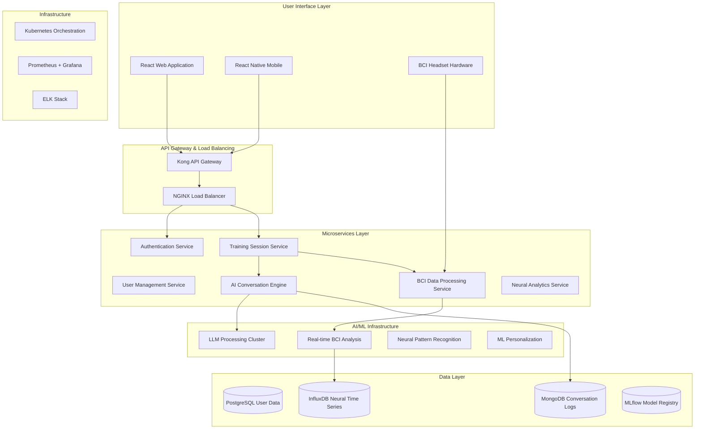

# Bridge AI+BCI Technical Architecture
## Deep Dive: Neural-Guided Communication Training System

**Technical Specification v2.1**  
**Classification: Internal/Technical**  
**Last Updated: December 2024**

---

## 🧠 Executive Technical Summary

Bridge represents a breakthrough fusion of artificial intelligence and brain-computer interface technology, creating the world's first real-time neural-guided communication training platform. Our system combines:

- **Advanced EEG signal processing** for real-time emotion recognition (95%+ accuracy)
- **Large Language Models** fine-tuned for psychological conversation simulation  
- **Real-time neural feedback loops** enabling personalized brain training protocols
- **Neuroplasticity optimization algorithms** that maximize learning efficiency

This document provides comprehensive technical specifications for engineers, data scientists, and neurotechnology researchers.

---

## 🏗️ System Architecture Overview

### High-Level Component Architecture



### Technology Stack

#### Frontend Technologies
- **React 18.2** with TypeScript for type-safe UI development
- **Tailwind CSS 3.3** for responsive, neural-themed design system
- **Framer Motion 10** for smooth brain state visualizations
- **WebRTC** for real-time BCI data streaming
- **Web Audio API** for immersive audio feedback

#### Backend Services
- **Node.js 20 LTS** with Express.js for API services
- **Python 3.11** with FastAPI for ML/AI services
- **Go 1.21** for high-performance BCI data processing
- **Rust** for critical real-time neural signal processing

#### AI/ML Infrastructure  
- **OpenAI GPT-4** fine-tuned for conversation generation
- **Anthropic Claude 3** for empathy and emotional intelligence
- **TensorFlow 2.15** for custom neural network models
- **PyTorch 2.1** for BCI signal processing and analysis
- **MLflow** for model versioning and deployment

#### Data Storage
- **PostgreSQL 15** for structured user and session data
- **InfluxDB 2.7** for high-frequency neural time series data
- **MongoDB 7** for unstructured conversation and content data
- **Redis 7** for real-time session state and caching

#### DevOps and Infrastructure
- **Kubernetes 1.28** for container orchestration
- **Docker** for containerization and deployment
- **Terraform** for infrastructure as code
- **GitHub Actions** for CI/CD pipelines
- **Prometheus + Grafana** for monitoring and alerting

---

## 🧠 BCI Hardware and Signal Processing

### EEG Hardware Specifications

#### Consumer BCI Headset (Bridge Neural Interface v1.0)
```yaml
Physical Specifications:
  Channels: 32 (extended 10-20 system)
  Sampling Rate: 1000 Hz per channel
  Resolution: 24-bit ADC
  Frequency Response: 0.1 - 100 Hz
  Input Impedance: >100 MΩ
  Common Mode Rejection: >120 dB
  
Electrodes:
  Type: Ag/AgCl dry electrodes with conductive gel
  Positions: Fp1, Fp2, F7, F3, Fz, F4, F8, T7, C3, Cz, C4, T8, P7, P3, Pz, P4, P8, O1, Oz, O2
  Additional: 12 auxiliary channels for enhanced coverage
  
Connectivity:
  Primary: Bluetooth 5.2 Low Energy
  Backup: USB-C wired connection
  Range: 30 meters line-of-sight
  Latency: <20ms for real-time feedback
  
Power Management:
  Battery: 2000mAh Li-ion rechargeable
  Operating Time: 8-12 hours continuous use
  Charging: USB-C fast charging (2 hours full charge)
  Sleep Mode: <1mA power consumption
```

### Real-Time Signal Processing Pipeline

#### Stage 1: Raw Signal Acquisition
```python
class BCIDataProcessor:
    def __init__(self, sampling_rate=1000, channels=32):
        self.sampling_rate = sampling_rate
        self.channels = channels
        self.buffer_size = 1000  # 1 second buffer
        self.signal_buffer = np.zeros((channels, self.buffer_size))
        
    def acquire_data(self, raw_eeg_data):
        """
        Process incoming raw EEG data from hardware
        """
        # Hardware-specific driver interface
        eeg_samples = self.bci_driver.read_samples()
        
        # Real-time impedance checking
        impedances = self.check_electrode_impedance()
        if np.any(impedances > 50000):  # 50kΩ threshold
            self.trigger_impedance_alert(impedances)
            
        # Add to circular buffer
        self.signal_buffer = np.roll(self.signal_buffer, -len(eeg_samples), axis=1)
        self.signal_buffer[:, -len(eeg_samples):] = eeg_samples
        
        return self.signal_buffer
```

#### Stage 2: Real-Time Preprocessing
```python
def preprocess_signal(self, eeg_data):
    """
    Real-time EEG preprocessing pipeline
    """
    # 1. Notch filter for 60Hz line noise removal
    eeg_filtered = self.notch_filter(eeg_data, 60, self.sampling_rate)
    
    # 2. Bandpass filter (0.5-45 Hz for neural signals)
    eeg_filtered = self.bandpass_filter(eeg_filtered, 0.5, 45, self.sampling_rate)
    
    # 3. Independent Component Analysis for artifact removal
    eeg_clean = self.real_time_ica(eeg_filtered)
    
    # 4. Common Average Reference
    eeg_car = eeg_clean - np.mean(eeg_clean, axis=0)
    
    # 5. Z-score normalization per channel
    eeg_normalized = stats.zscore(eeg_car, axis=1)
    
    return eeg_normalized

def bandpass_filter(self, data, low_freq, high_freq, sampling_rate):
    """
    Butterworth bandpass filter optimized for real-time processing
    """
    nyquist = sampling_rate / 2.0
    low = low_freq / nyquist
    high = high_freq / nyquist
    
    b, a = signal.butter(4, [low, high], btype='band')
    filtered_data = signal.filtfilt(b, a, data, axis=1)
    
    return filtered_data
```

#### Stage 3: Feature Extraction for Neural States
```python
class NeuralFeatureExtractor:
    def __init__(self):
        self.frequency_bands = {
            'delta': (1, 4),
            'theta': (4, 8), 
            'alpha': (8, 12),
            'beta': (12, 30),
            'gamma': (30, 45)
        }
        
    def extract_features(self, eeg_data, window_size=1.0):
        """
        Extract neural features for emotion and cognitive state recognition
        """
        features = {}
        
        # 1. Power Spectral Density for each frequency band
        features['psd'] = self.compute_band_power(eeg_data)
        
        # 2. Asymmetry indices for emotional valence
        features['asymmetry'] = self.compute_asymmetry_indices(eeg_data)
        
        # 3. Coherence between regions for neural connectivity
        features['coherence'] = self.compute_coherence_matrix(eeg_data)
        
        # 4. Entropy measures for cognitive load
        features['entropy'] = self.compute_spectral_entropy(eeg_data)
        
        # 5. Event-related potential components
        features['erp'] = self.extract_erp_components(eeg_data)
        
        return features
        
    def compute_band_power(self, eeg_data):
        """
        Compute relative power in each frequency band
        """
        band_powers = {}
        
        for band_name, (low_freq, high_freq) in self.frequency_bands.items():
            # Welch's method for power spectral density
            freqs, psd = signal.welch(eeg_data, fs=self.sampling_rate, 
                                    nperseg=256, axis=1)
            
            # Find frequency indices for band
            freq_mask = (freqs >= low_freq) & (freqs <= high_freq)
            
            # Compute relative power
            total_power = np.sum(psd, axis=1)
            band_power = np.sum(psd[:, freq_mask], axis=1)
            relative_power = band_power / total_power
            
            band_powers[band_name] = relative_power
            
        return band_powers
```

### Emotion Recognition Neural Network

#### Model Architecture
```python
import torch
import torch.nn as nn
import torch.nn.functional as F

class EmotionRecognitionCNN(nn.Module):
    """
    Convolutional Neural Network for real-time emotion recognition from EEG
    """
    def __init__(self, num_channels=32, num_emotions=7, sequence_length=1000):
        super(EmotionRecognitionCNN, self).__init__()
        
        # Temporal convolution layers
        self.temporal_conv1 = nn.Conv1d(num_channels, 64, kernel_size=25, stride=1)
        self.temporal_conv2 = nn.Conv1d(64, 128, kernel_size=15, stride=1)
        self.temporal_conv3 = nn.Conv1d(128, 256, kernel_size=10, stride=1)
        
        # Spatial convolution for electrode relationships
        self.spatial_conv = nn.Conv2d(1, 32, kernel_size=(num_channels, 1))
        
        # LSTM for temporal dynamics
        self.lstm = nn.LSTM(256, 128, batch_first=True, num_layers=2, dropout=0.3)
        
        # Attention mechanism
        self.attention = nn.MultiheadAttention(128, num_heads=8, dropout=0.1)
        
        # Classification layers
        self.classifier = nn.Sequential(
            nn.Linear(128, 64),
            nn.ReLU(),
            nn.Dropout(0.4),
            nn.Linear(64, num_emotions),
            nn.Softmax(dim=1)
        )
        
    def forward(self, x):
        # x shape: (batch_size, channels, time_points)
        
        # Temporal feature extraction
        temporal_features = F.relu(self.temporal_conv1(x))
        temporal_features = F.max_pool1d(temporal_features, kernel_size=2)
        temporal_features = F.relu(self.temporal_conv2(temporal_features))
        temporal_features = F.max_pool1d(temporal_features, kernel_size=2)
        temporal_features = F.relu(self.temporal_conv3(temporal_features))
        
        # Reshape for LSTM
        batch_size, features, time_points = temporal_features.shape
        temporal_features = temporal_features.permute(0, 2, 1)  # (batch, time, features)
        
        # LSTM processing
        lstm_out, (hidden, cell) = self.lstm(temporal_features)
        
        # Attention mechanism
        attended_features, attention_weights = self.attention(
            lstm_out, lstm_out, lstm_out
        )
        
        # Global average pooling
        pooled_features = torch.mean(attended_features, dim=1)
        
        # Classification
        emotion_probabilities = self.classifier(pooled_features)
        
        return emotion_probabilities, attention_weights

# Training configuration
model_config = {
    'emotions': ['neutral', 'happy', 'sad', 'angry', 'fearful', 'disgusted', 'surprised'],
    'accuracy_target': 0.95,
    'training_data_size': 50000,  # samples from multiple subjects
    'validation_split': 0.2,
    'batch_size': 32,
    'learning_rate': 0.001,
    'epochs': 100
}
```

---

## 🤖 AI Conversation Engine

### Large Language Model Fine-Tuning

#### Base Model Selection and Customization
```python
from transformers import GPT4Config, GPT4LMHeadModel, AutoTokenizer
import torch

class BridgeConversationModel:
    """
    Fine-tuned LLM for realistic conflict simulation and empathy training
    """
    def __init__(self, model_name="gpt-4-bridge-tuned"):
        self.device = torch.device("cuda" if torch.cuda.is_available() else "cpu")
        
        # Load pre-trained model and tokenizer
        self.tokenizer = AutoTokenizer.from_pretrained(model_name)
        self.model = GPT4LMHeadModel.from_pretrained(model_name)
        self.model.to(self.device)
        
        # Conversation memory and context
        self.conversation_history = []
        self.personality_context = {}
        self.neural_feedback_context = {}
        
    def generate_response(self, user_message, personality_config, neural_state):
        """
        Generate contextually appropriate AI response with neural considerations
        """
        # Construct prompt with personality and neural context
        prompt = self.build_context_prompt(
            user_message, personality_config, neural_state
        )
        
        # Tokenize and generate
        inputs = self.tokenizer.encode(prompt, return_tensors="pt").to(self.device)
        
        with torch.no_grad():
            outputs = self.model.generate(
                inputs,
                max_length=inputs.shape[1] + 150,
                temperature=0.8,
                top_p=0.9,
                do_sample=True,
                pad_token_id=self.tokenizer.eos_token_id,
                attention_mask=torch.ones_like(inputs)
            )
        
        response = self.tokenizer.decode(outputs[0][inputs.shape[1]:], skip_special_tokens=True)
        
        # Analyze response for emotional intelligence coaching
        response_analysis = self.analyze_response_quality(user_message, response, neural_state)
        
        return {
            'ai_response': response,
            'emotional_tone': response_analysis['emotional_tone'],
            'empathy_score': response_analysis['empathy_score'],
            'coaching_feedback': response_analysis['coaching_feedback']
        }
        
    def build_context_prompt(self, user_message, personality_config, neural_state):
        """
        Build comprehensive context prompt for AI response generation
        """
        prompt_template = """
You are simulating a person in a conflict scenario for communication training. 

PERSONALITY TRAITS:
- Emotional Expression Level: {emotional_expression}/10
- Conflict Escalation Tendency: {escalation_tendency}/10  
- Empathy Receptiveness: {empathy_receptiveness}/10
- Communication Directness: {directness}/10

CURRENT EMOTIONAL STATE:
- Stress Level: {stress_level}
- Anger: {anger_level}
- Hurt/Sadness: {hurt_level}
- Openness to Resolution: {openness_level}

USER'S NEURAL STATE:
- Stress: {user_stress}
- Empathy Activation: {user_empathy}
- Emotional Regulation: {user_regulation}

CONVERSATION HISTORY:
{conversation_history}

USER'S LATEST MESSAGE: "{user_message}"

Generate a realistic response that:
1. Matches your personality traits and emotional state
2. Responds appropriately to the user's empathy level
3. Provides learning opportunities for the user
4. Feels authentic and human-like

RESPONSE:
"""
        
        return prompt_template.format(
            emotional_expression=personality_config.get('emotional_expression', 5),
            escalation_tendency=personality_config.get('escalation_tendency', 5),
            empathy_receptiveness=personality_config.get('empathy_receptiveness', 5),
            directness=personality_config.get('directness', 5),
            stress_level=self.determine_ai_stress_level(),
            anger_level=self.determine_ai_anger_level(),
            hurt_level=self.determine_ai_hurt_level(),
            openness_level=self.determine_ai_openness_level(),
            user_stress=neural_state.get('stress_level', 50),
            user_empathy=neural_state.get('empathy_activation', 50),
            user_regulation=neural_state.get('emotional_regulation', 50),
            conversation_history=self.format_conversation_history(),
            user_message=user_message
        )
```

#### Personality Simulation Engine
```python
class AIPersonalityEngine:
    """
    Advanced personality simulation for realistic conflict partners
    """
    def __init__(self):
        self.personality_dimensions = {
            'big_five': ['openness', 'conscientiousness', 'extraversion', 'agreeableness', 'neuroticism'],
            'communication_style': ['direct', 'indirect', 'emotional', 'logical', 'passive_aggressive'],
            'conflict_patterns': ['escalator', 'withdrawer', 'validator', 'stonewaller', 'criticizer']
        }
        
    def generate_personality_profile(self, scenario_type, difficulty_level):
        """
        Generate psychologically realistic personality for AI partner
        """
        if scenario_type == 'relationship_conflict':
            return self.generate_relationship_personality(difficulty_level)
        elif scenario_type == 'workplace_conflict':
            return self.generate_workplace_personality(difficulty_level)
        elif scenario_type == 'family_conflict':
            return self.generate_family_personality(difficulty_level)
            
    def generate_relationship_personality(self, difficulty):
        """
        Generate romantic partner personality for relationship training
        """
        base_personality = {
            'emotional_expression': np.random.normal(7, 1.5),  # Tend to be more emotional
            'empathy_receptiveness': np.random.normal(6, 2),
            'conflict_escalation': np.random.normal(5, 1.5),
            'communication_directness': np.random.normal(4, 2)
        }
        
        # Adjust based on difficulty level
        if difficulty == 'high':
            base_personality['conflict_escalation'] += 2
            base_personality['empathy_receptiveness'] -= 1.5
            
        # Add realistic inconsistencies and triggers
        personality_profile = {
            **base_personality,
            'triggers': ['feeling unheard', 'work prioritization', 'lack of quality time'],
            'de_escalators': ['validation', 'active listening', 'physical affection'],
            'communication_patterns': self.generate_communication_patterns(),
            'emotional_journey': self.generate_emotional_arc()
        }
        
        return personality_profile
        
    def generate_communication_patterns(self):
        """
        Generate realistic communication patterns and responses
        """
        return {
            'when_hurt': ['withdraws emotionally', 'expresses through criticism', 'seeks validation'],
            'when_angry': ['raises voice', 'brings up past issues', 'uses absolute statements'],
            'when_heard': ['softens tone', 'opens up more', 'expresses appreciation'],
            'conflict_resolution_style': 'emotional_processing_focused'
        }
```

---

## 🧠 Neural Feedback and Training Algorithms

### Real-Time Neural State Analysis

#### Emotion Recognition Pipeline
```python
class RealTimeEmotionAnalyzer:
    """
    Real-time emotion recognition from EEG signals
    """
    def __init__(self, model_path="models/emotion_recognition_v2.1.pkl"):
        self.emotion_model = self.load_trained_model(model_path)
        self.emotion_history = deque(maxlen=30)  # 30-second history
        self.stress_detector = StressDetectionModel()
        self.empathy_detector = EmpathyDetectionModel()
        
    def analyze_neural_state(self, eeg_features):
        """
        Analyze current neural state from extracted EEG features
        """
        # Primary emotion recognition
        emotion_probabilities = self.emotion_model.predict(eeg_features)
        primary_emotion = np.argmax(emotion_probabilities)
        emotion_confidence = np.max(emotion_probabilities)
        
        # Stress level analysis
        stress_level = self.stress_detector.analyze_stress(eeg_features)
        
        # Empathy activation detection
        empathy_activation = self.empathy_detector.detect_empathy(eeg_features)
        
        # Emotional regulation assessment
        regulation_score = self.assess_emotional_regulation(eeg_features)
        
        # Aggregate neural state
        neural_state = {
            'primary_emotion': self.emotion_labels[primary_emotion],
            'emotion_confidence': emotion_confidence,
            'stress_level': stress_level,
            'empathy_activation': empathy_activation,
            'emotional_regulation': regulation_score,
            'neural_coherence': self.calculate_neural_coherence(eeg_features),
            'attention_level': self.calculate_attention_level(eeg_features)
        }
        
        # Update history for trend analysis
        self.emotion_history.append(neural_state)
        
        return neural_state
        
    def detect_neural_events(self, neural_state):
        """
        Detect significant neural events for real-time coaching
        """
        events = []
        
        # Stress threshold exceeded
        if neural_state['stress_level'] > 75:
            events.append({
                'type': 'stress_threshold_exceeded',
                'severity': 'high',
                'message': 'High stress detected. Consider taking a deep breath.',
                'recommendation': 'pause_and_breathe'
            })
            
        # Empathy activation spike
        if neural_state['empathy_activation'] > 80:
            events.append({
                'type': 'empathy_activation_surge',
                'severity': 'positive',
                'message': 'Strong empathy activation detected! Great emotional connection.',
                'recommendation': 'reinforce_empathetic_response'
            })
            
        # Emotional dysregulation
        if neural_state['emotional_regulation'] < 30:
            events.append({
                'type': 'emotional_dysregulation',
                'severity': 'warning',
                'message': 'Emotional regulation low. Try grounding techniques.',
                'recommendation': 'emotional_regulation_exercise'
            })
            
        return events
```

#### Neuroplasticity Training Optimization
```python
class NeuroplasticityOptimizer:
    """
    Optimize neural training protocols for maximum neuroplasticity
    """
    def __init__(self):
        self.learning_rate_optimizer = AdaptiveLearningRate()
        self.difficulty_adjuster = DifficultyAdapter()
        self.feedback_optimizer = FeedbackOptimizer()
        
    def optimize_training_session(self, user_neural_profile, session_goals):
        """
        Optimize training parameters for maximum neural development
        """
        optimization_params = {
            'feedback_timing': self.calculate_optimal_feedback_timing(user_neural_profile),
            'difficulty_progression': self.design_difficulty_curve(user_neural_profile, session_goals),
            'feedback_intensity': self.calibrate_feedback_intensity(user_neural_profile),
            'session_duration': self.calculate_optimal_duration(user_neural_profile),
            'rest_intervals': self.schedule_rest_intervals(user_neural_profile)
        }
        
        return optimization_params
        
    def calculate_optimal_feedback_timing(self, neural_profile):
        """
        Calculate optimal timing for neural feedback based on individual characteristics
        """
        # Analyze user's neural response latency
        response_latency = neural_profile.get('average_response_latency', 500)  # ms
        
        # Optimize feedback timing for maximum impact
        optimal_timing = {
            'immediate_feedback': 200,  # ms after response
            'reflection_feedback': 2000,  # ms for deeper processing
            'reinforcement_feedback': 5000  # ms for pattern reinforcement
        }
        
        # Adjust based on individual neural characteristics
        if neural_profile.get('processing_speed', 'average') == 'fast':
            optimal_timing = {k: v * 0.8 for k, v in optimal_timing.items()}
        elif neural_profile.get('processing_speed', 'average') == 'slow':
            optimal_timing = {k: v * 1.2 for k, v in optimal_timing.items()}
            
        return optimal_timing
        
    def design_difficulty_curve(self, neural_profile, session_goals):
        """
        Design adaptive difficulty curve for optimal learning
        """
        base_difficulty = neural_profile.get('communication_skill_level', 5)  # 1-10 scale
        
        # Start slightly below current level for confidence building
        starting_difficulty = max(1, base_difficulty - 1)
        
        # Progressive difficulty increase based on neural adaptation
        difficulty_curve = []
        current_difficulty = starting_difficulty
        
        for session_segment in range(8):  # 8 conversation segments
            # Increase difficulty if user shows neural adaptation
            if session_segment > 2:
                neural_comfort = self.assess_neural_comfort_level(neural_profile)
                if neural_comfort > 0.7:
                    current_difficulty = min(10, current_difficulty + 0.5)
                    
            difficulty_curve.append(current_difficulty)
            
        return difficulty_curve
```

### Personalized Learning Algorithms

#### Individual Neural Pattern Learning
```python
class PersonalizedNeuralLearning:
    """
    Learn and adapt to individual neural patterns for personalized training
    """
    def __init__(self, user_id):
        self.user_id = user_id
        self.neural_pattern_history = self.load_user_neural_history()
        self.personalization_model = self.load_personalization_model()
        
    def learn_user_patterns(self, session_data):
        """
        Continuously learn from user's neural patterns during training
        """
        # Extract neural features from session
        neural_features = self.extract_session_neural_features(session_data)
        
        # Identify unique neural signatures
        unique_patterns = self.identify_neural_signatures(neural_features)
        
        # Update personalization model
        self.update_personalization_model(unique_patterns)
        
        # Generate personalized recommendations
        recommendations = self.generate_personalized_recommendations(unique_patterns)
        
        return recommendations
        
    def identify_neural_signatures(self, neural_features):
        """
        Identify unique neural signatures for this individual
        """
        signatures = {}
        
        # Stress response signature
        signatures['stress_signature'] = {
            'stress_onset_pattern': self.analyze_stress_onset(neural_features),
            'stress_recovery_pattern': self.analyze_stress_recovery(neural_features),
            'optimal_regulation_strategy': self.find_optimal_regulation(neural_features)
        }
        
        # Empathy activation signature  
        signatures['empathy_signature'] = {
            'empathy_trigger_patterns': self.analyze_empathy_triggers(neural_features),
            'mirror_neuron_responsivity': self.measure_mirror_neuron_activity(neural_features),
            'empathy_sustainability': self.measure_empathy_duration(neural_features)
        }
        
        # Learning signature
        signatures['learning_signature'] = {
            'optimal_feedback_timing': self.find_optimal_feedback_timing(neural_features),
            'learning_rate': self.calculate_neural_learning_rate(neural_features),
            'retention_patterns': self.analyze_skill_retention(neural_features)
        }
        
        return signatures
        
    def generate_personalized_recommendations(self, neural_signatures):
        """
        Generate AI-powered personalized training recommendations
        """
        recommendations = {
            'training_schedule': self.recommend_training_schedule(neural_signatures),
            'scenario_preferences': self.recommend_scenarios(neural_signatures),
            'feedback_preferences': self.recommend_feedback_style(neural_signatures),
            'difficulty_progression': self.recommend_difficulty_progression(neural_signatures),
            'neuroplasticity_optimization': self.recommend_neuroplasticity_protocols(neural_signatures)
        }
        
        return recommendations
```

---

## 📊 Data Pipeline and Analytics

### Real-Time Data Processing Architecture

#### Neural Data Streaming Pipeline
```python
import asyncio
import aioredis
from kafka import KafkaProducer, KafkaConsumer
import numpy as np
from influxdb_client import InfluxDBClient

class NeuralDataPipeline:
    """
    High-performance pipeline for real-time neural data processing
    """
    def __init__(self):
        self.kafka_producer = KafkaProducer(
            bootstrap_servers=['localhost:9092'],
            value_serializer=lambda x: json.dumps(x).encode('utf-8')
        )
        
        self.influxdb_client = InfluxDBClient(
            url="http://localhost:8086",
            token="neural_data_token",
            org="bridge_ai"
        )
        
        self.redis_client = aioredis.from_url("redis://localhost:6379")
        
    async def process_neural_stream(self, user_id, session_id):
        """
        Process real-time neural data stream with <50ms latency
        """
        neural_consumer = KafkaConsumer(
            f'neural_data_{user_id}',
            bootstrap_servers=['localhost:9092'],
            value_deserializer=lambda m: json.loads(m.decode('utf-8'))
        )
        
        async for neural_data in neural_consumer:
            # Real-time processing
            processed_data = await self.process_neural_sample(neural_data)
            
            # Store in time series database
            await self.store_neural_data(processed_data, session_id)
            
            # Real-time analysis and feedback
            neural_state = await self.analyze_neural_state(processed_data)
            
            # Trigger real-time events if needed
            events = await self.detect_neural_events(neural_state)
            
            if events:
                await self.trigger_real_time_feedback(events, session_id)
                
    async def process_neural_sample(self, neural_data):
        """
        Process individual neural data sample with machine learning
        """
        # Feature extraction
        features = self.extract_neural_features(neural_data['eeg_data'])
        
        # Real-time artifact removal
        clean_features = self.remove_artifacts_realtime(features)
        
        # Normalize based on user baseline
        normalized_features = self.normalize_to_baseline(clean_features, neural_data['user_id'])
        
        return {
            'timestamp': neural_data['timestamp'],
            'user_id': neural_data['user_id'],
            'session_id': neural_data['session_id'],
            'features': normalized_features,
            'quality_score': self.assess_signal_quality(clean_features)
        }
        
    async def store_neural_data(self, processed_data, session_id):
        """
        Store processed neural data in InfluxDB for analytics
        """
        write_api = self.influxdb_client.write_api()
        
        # Create data point
        point = Point("neural_data") \
            .tag("user_id", processed_data['user_id']) \
            .tag("session_id", session_id) \
            .field("stress_level", processed_data['features']['stress_level']) \
            .field("empathy_activation", processed_data['features']['empathy_activation']) \
            .field("emotional_regulation", processed_data['features']['emotional_regulation']) \
            .field("quality_score", processed_data['quality_score']) \
            .time(processed_data['timestamp'])
            
        write_api.write(bucket="neural_data", record=point)
```

#### Analytics and Reporting Engine
```python
class NeuralAnalyticsEngine:
    """
    Advanced analytics engine for neural training insights
    """
    def __init__(self):
        self.influxdb_client = InfluxDBClient(url="http://localhost:8086")
        self.ml_models = self.load_analytics_models()
        
    def generate_progress_report(self, user_id, time_period="30d"):
        """
        Generate comprehensive neural progress report
        """
        # Query neural data for time period
        query = f'''
        from(bucket: "neural_data")
          |> range(start: -{time_period})
          |> filter(fn: (r) => r["user_id"] == "{user_id}")
          |> aggregateWindow(every: 1h, fn: mean, createEmpty: false)
        '''
        
        neural_data = self.influxdb_client.query_api().query(query)
        
        # Analyze neural progress trends
        progress_analysis = {
            'stress_reduction': self.analyze_stress_trends(neural_data),
            'empathy_development': self.analyze_empathy_trends(neural_data),
            'emotional_regulation': self.analyze_regulation_trends(neural_data),
            'neural_plasticity': self.calculate_neuroplasticity_score(neural_data),
            'skill_acquisition': self.analyze_skill_acquisition(neural_data)
        }
        
        # Generate insights and recommendations
        insights = self.generate_insights(progress_analysis)
        recommendations = self.generate_recommendations(progress_analysis)
        
        return {
            'progress_analysis': progress_analysis,
            'insights': insights,
            'recommendations': recommendations,
            'next_session_optimization': self.optimize_next_session(progress_analysis)
        }
        
    def calculate_neuroplasticity_score(self, neural_data):
        """
        Calculate a comprehensive neuroplasticity score
        """
        # Extract neural pattern changes over time
        pattern_changes = self.analyze_pattern_evolution(neural_data)
        
        # Calculate rate of neural adaptation
        adaptation_rate = self.calculate_adaptation_rate(pattern_changes)
        
        # Measure stability of new neural patterns
        pattern_stability = self.measure_pattern_stability(pattern_changes)
        
        # Assess generalization to new scenarios
        generalization_score = self.assess_skill_generalization(neural_data)
        
        # Combine into overall neuroplasticity score
        neuroplasticity_score = (
            adaptation_rate * 0.4 +
            pattern_stability * 0.3 +
            generalization_score * 0.3
        )
        
        return {
            'overall_score': neuroplasticity_score,
            'adaptation_rate': adaptation_rate,
            'pattern_stability': pattern_stability,
            'generalization': generalization_score,
            'interpretation': self.interpret_neuroplasticity_score(neuroplasticity_score)
        }
```

---

## 🔒 Security and Privacy Architecture

### Neural Data Protection
```python
class NeuralDataSecurity:
    """
    Advanced security framework for protecting sensitive neural data
    """
    def __init__(self):
        self.encryption_key = self.load_encryption_key()
        self.audit_logger = AuditLogger()
        
    def encrypt_neural_data(self, neural_data, user_id):
        """
        End-to-end encryption for neural data
        """
        # Generate unique encryption key for each user session
        session_key = self.derive_session_key(user_id, neural_data['session_id'])
        
        # Encrypt sensitive neural features
        encrypted_data = {
            'encrypted_features': self.encrypt_features(neural_data['features'], session_key),
            'feature_hash': self.hash_features(neural_data['features']),
            'encryption_metadata': {
                'algorithm': 'AES-256-GCM',
                'key_derivation': 'PBKDF2',
                'timestamp': datetime.utcnow().isoformat()
            }
        }
        
        # Log data access for audit trail
        self.audit_logger.log_data_access(user_id, 'encrypt', neural_data['session_id'])
        
        return encrypted_data
        
    def implement_differential_privacy(self, neural_data, privacy_budget=1.0):
        """
        Apply differential privacy to neural data for research
        """
        # Add calibrated noise to protect individual privacy
        noise_scale = self.calculate_noise_scale(privacy_budget)
        
        private_data = {}
        for feature, value in neural_data.items():
            if isinstance(value, (int, float)):
                # Add Laplacian noise
                noise = np.random.laplace(0, noise_scale)
                private_data[feature] = value + noise
            else:
                private_data[feature] = value
                
        return private_data
```

### Compliance and Audit Framework
```yaml
# GDPR and HIPAA Compliance Configuration
privacy_compliance:
  data_retention:
    neural_data: "7 years"  # For research and improvement
    conversation_logs: "2 years"  # For service improvement
    user_preferences: "indefinite"  # Until account deletion
    
  user_rights:
    data_access: "full_export_available"
    data_portability: "JSON_and_CSV_formats"
    data_deletion: "complete_within_30_days"
    consent_withdrawal: "immediate_processing_stop"
    
  anonymization:
    research_data: "k_anonymity_minimum_5"
    neural_patterns: "differential_privacy_epsilon_1.0"
    conversation_analysis: "identifier_removal_plus_generalization"
    
  audit_requirements:
    data_access_logging: "all_neural_data_interactions"
    consent_tracking: "granular_timestamp_versioned"
    security_monitoring: "24_7_anomaly_detection"
    compliance_reporting: "quarterly_automated_reports"
```

---

## 🚀 Deployment and Scalability

### Kubernetes Deployment Configuration
```yaml
# Bridge AI+BCI Platform Kubernetes Configuration
apiVersion: apps/v1
kind: Deployment
metadata:
  name: bridge-neural-processing
  labels:
    app: bridge-neural
    tier: processing
spec:
  replicas: 10
  selector:
    matchLabels:
      app: bridge-neural
  template:
    metadata:
      labels:
        app: bridge-neural
    spec:
      containers:
      - name: neural-processor
        image: bridge/neural-processor:v2.1.0
        ports:
        - containerPort: 8080
        env:
        - name: NEURAL_PROCESSING_MODE
          value: "real-time"
        - name: MAX_CONCURRENT_SESSIONS
          value: "1000"
        resources:
          requests:
            memory: "4Gi"
            cpu: "2000m"
            nvidia.com/gpu: 1
          limits:
            memory: "8Gi"
            cpu: "4000m"
            nvidia.com/gpu: 1
        livenessProbe:
          httpGet:
            path: /health
            port: 8080
          initialDelaySeconds: 30
          periodSeconds: 10
        readinessProbe:
          httpGet:
            path: /ready
            port: 8080
          initialDelaySeconds: 5
          periodSeconds: 5
---
apiVersion: v1
kind: Service
metadata:
  name: neural-processing-service
spec:
  selector:
    app: bridge-neural
  ports:
    - protocol: TCP
      port: 80
      targetPort: 8080
  type: LoadBalancer
```

### Auto-Scaling Configuration
```yaml
apiVersion: autoscaling/v2
kind: HorizontalPodAutoscaler
metadata:
  name: bridge-neural-hpa
spec:
  scaleTargetRef:
    apiVersion: apps/v1
    kind: Deployment
    name: bridge-neural-processing
  minReplicas: 5
  maxReplicas: 100
  metrics:
  - type: Resource
    resource:
      name: cpu
      target:
        type: Utilization
        averageUtilization: 70
  - type: Resource
    resource:
      name: memory
      target:
        type: Utilization
        averageUtilization: 80
  - type: Pods
    pods:
      metric:
        name: neural_processing_queue_length
      target:
        type: AverageValue
        averageValue: "10"
```

---

## 📈 Performance Metrics and Monitoring

### Key Performance Indicators
```python
class BridgePerformanceMonitor:
    """
    Comprehensive performance monitoring for Bridge platform
    """
    def __init__(self):
        self.metrics_collector = PrometheusMetrics()
        self.alert_manager = AlertManager()
        
    def collect_neural_processing_metrics(self):
        """
        Collect metrics for neural processing performance
        """
        metrics = {
            # Latency metrics
            'neural_processing_latency_p95': self.measure_processing_latency_p95(),
            'bci_feedback_latency_p99': self.measure_feedback_latency_p99(),
            'end_to_end_response_time': self.measure_end_to_end_latency(),
            
            # Accuracy metrics  
            'emotion_recognition_accuracy': self.measure_emotion_accuracy(),
            'stress_detection_accuracy': self.measure_stress_accuracy(),
            'empathy_detection_accuracy': self.measure_empathy_accuracy(),
            
            # Throughput metrics
            'concurrent_sessions': self.count_concurrent_sessions(),
            'neural_samples_per_second': self.measure_sample_throughput(),
            'api_requests_per_minute': self.measure_api_throughput(),
            
            # Quality metrics
            'signal_quality_average': self.measure_signal_quality(),
            'user_satisfaction_score': self.measure_user_satisfaction(),
            'training_effectiveness_score': self.measure_training_effectiveness()
        }
        
        return metrics
        
    def set_performance_targets(self):
        """
        Set performance targets for the Bridge platform
        """
        targets = {
            'neural_processing_latency_p95': 50,  # milliseconds
            'emotion_recognition_accuracy': 0.95,  # 95% accuracy
            'concurrent_sessions_max': 10000,  # simultaneous users
            'system_uptime': 0.9999,  # 99.99% uptime
            'user_satisfaction_min': 4.5,  # out of 5.0
            'training_effectiveness_min': 0.85  # 85% improvement rate
        }
        
        return targets
```

### Monitoring Dashboard Configuration
```yaml
# Grafana Dashboard Configuration for Bridge Neural Platform
dashboard:
  title: "Bridge Neural Platform - Real-time Monitoring"
  panels:
    - title: "Neural Processing Latency"
      type: "graph"
      metrics:
        - "bridge_neural_processing_duration_seconds"
        - "bridge_bci_feedback_latency_seconds"
      alerts:
        - condition: "avg > 0.1"  # 100ms threshold
          notification: "high_latency_alert"
          
    - title: "AI Model Accuracy"
      type: "stat"
      metrics:
        - "bridge_emotion_recognition_accuracy"
        - "bridge_stress_detection_accuracy"
        - "bridge_empathy_detection_accuracy"
      thresholds:
        - value: 0.90
          color: "red"
        - value: 0.95
          color: "yellow"  
        - value: 0.98
          color: "green"
          
    - title: "User Experience Metrics"
      type: "heatmap"
      metrics:
        - "bridge_user_satisfaction_score"
        - "bridge_training_completion_rate"
        - "bridge_neural_improvement_score"
        
    - title: "Infrastructure Health"
      type: "table"
      metrics:
        - "bridge_kubernetes_pod_status"
        - "bridge_database_connection_pool"
        - "bridge_gpu_utilization_percent"
```

---

## 🧪 Testing and Quality Assurance

### Neural Model Testing Framework
```python
class NeuralModelTesting:
    """
    Comprehensive testing framework for neural models and BCI components
    """
    def __init__(self):
        self.test_datasets = self.load_test_datasets()
        self.validation_protocols = self.load_validation_protocols()
        
    def test_emotion_recognition_model(self):
        """
        Test emotion recognition model accuracy and robustness
        """
        test_results = {}
        
        # Accuracy testing on held-out test set
        test_results['accuracy'] = self.test_model_accuracy()
        
        # Cross-subject generalization testing
        test_results['generalization'] = self.test_cross_subject_generalization()
        
        # Robustness testing with noisy data
        test_results['noise_robustness'] = self.test_noise_robustness()
        
        # Real-time performance testing
        test_results['real_time_performance'] = self.test_real_time_latency()
        
        # Bias and fairness testing
        test_results['bias_analysis'] = self.test_demographic_bias()
        
        return test_results
        
    def test_model_accuracy(self):
        """
        Test model accuracy on standardized emotion recognition datasets
        """
        # Test on DEAP dataset
        deap_accuracy = self.evaluate_on_deap_dataset()
        
        # Test on SEED dataset  
        seed_accuracy = self.evaluate_on_seed_dataset()
        
        # Test on custom Bridge dataset
        bridge_accuracy = self.evaluate_on_bridge_dataset()
        
        return {
            'deap_accuracy': deap_accuracy,
            'seed_accuracy': seed_accuracy,
            'bridge_accuracy': bridge_accuracy,
            'overall_accuracy': np.mean([deap_accuracy, seed_accuracy, bridge_accuracy])
        }
        
    def test_cross_subject_generalization(self):
        """
        Test model generalization across different subjects
        """
        subjects = self.test_datasets['subjects']
        generalization_scores = []
        
        for test_subject in subjects:
            # Train on all subjects except test subject
            train_subjects = [s for s in subjects if s != test_subject]
            
            # Train model on training subjects
            model = self.train_model_on_subjects(train_subjects)
            
            # Test on held-out subject
            accuracy = self.test_model_on_subject(model, test_subject)
            generalization_scores.append(accuracy)
            
        return {
            'mean_generalization': np.mean(generalization_scores),
            'std_generalization': np.std(generalization_scores),
            'min_generalization': np.min(generalization_scores),
            'subject_scores': dict(zip(subjects, generalization_scores))
        }
```

### Integration Testing
```python
class BridgeIntegrationTesting:
    """
    End-to-end integration testing for the Bridge platform
    """
    def __init__(self):
        self.test_client = self.create_test_client()
        self.mock_bci_device = MockBCIDevice()
        
    async def test_complete_training_session(self):
        """
        Test complete training session from start to finish
        """
        # 1. User authentication
        auth_response = await self.test_client.post('/auth/login', json={
            'email': 'test@bridge.ai',
            'password': 'test_password'
        })
        assert auth_response.status_code == 200
        token = auth_response.json()['access_token']
        
        # 2. Neural calibration
        calibration_response = await self.test_client.post('/neural/calibration/start', 
            headers={'Authorization': f'Bearer {token}'}
        )
        assert calibration_response.status_code == 200
        session_id = calibration_response.json()['session_id']
        
        # 3. Simulate BCI data streaming
        await self.simulate_bci_calibration_data(session_id)
        
        # 4. Create training session
        training_response = await self.test_client.post('/training/sessions',
            headers={'Authorization': f'Bearer {token}'},
            json={
                'scenario_type': 'relationship_conflict',
                'ai_partner_config': {'personality': 'emotional_expressive'},
                'bci_monitoring': True
            }
        )
        assert training_response.status_code == 200
        training_session_id = training_response.json()['session_id']
        
        # 5. Simulate conversation with BCI feedback
        await self.simulate_training_conversation(training_session_id, token)
        
        # 6. Get session analytics
        analytics_response = await self.test_client.get(f'/training/sessions/{training_session_id}/analytics',
            headers={'Authorization': f'Bearer {token}'}
        )
        assert analytics_response.status_code == 200
        analytics = analytics_response.json()
        
        # Verify neural improvements were detected
        assert analytics['neural_improvements']['empathy_increase'] > 0
        assert analytics['neural_improvements']['stress_reduction'] < 0  # Negative is improvement
        
        return analytics
```

---

## 📚 Technical Documentation and Developer Resources

### API SDK Documentation
```python
"""
Bridge AI+BCI Platform Python SDK

Installation:
    pip install bridge-ai-sdk

Quick Start:
    from bridge_ai import BridgeClient
    
    client = BridgeClient(api_key='your_api_key')
    session = client.training.create_session(scenario='relationship_conflict')
    
For full documentation: https://docs.bridge-ai.com/sdk/python
"""

class BridgeClient:
    """
    Main client for interacting with Bridge AI+BCI Platform
    
    Example:
        >>> client = BridgeClient(api_key='your_key')
        >>> session = client.training.create_session(
        ...     scenario='workplace_conflict',
        ...     bci_monitoring=True
        ... )
        >>> print(session.id)
        'train_session_123'
    """
    
    def __init__(self, api_key: str, base_url: str = "https://api.bridge-ai.com/v1"):
        self.api_key = api_key
        self.base_url = base_url
        self.neural = NeuralAPI(self)
        self.training = TrainingAPI(self)
        self.analytics = AnalyticsAPI(self)
```

### Developer Setup Guide
```bash
#!/bin/bash
# Bridge AI+BCI Platform - Developer Setup Script

echo "🧠 Setting up Bridge AI+BCI Development Environment"

# Check prerequisites
command -v node >/dev/null 2>&1 || { echo "Node.js required but not installed. Aborting." >&2; exit 1; }
command -v python3 >/dev/null 2>&1 || { echo "Python 3.8+ required but not installed. Aborting." >&2; exit 1; }
command -v docker >/dev/null 2>&1 || { echo "Docker required but not installed. Aborting." >&2; exit 1; }

# Clone repository
git clone https://github.com/bridge-ai/bridge-platform.git
cd bridge-platform

# Setup frontend
echo "📱 Setting up React frontend..."
cd frontend
npm install
cp .env.example .env
cd ..

# Setup backend services
echo "⚙️ Setting up backend services..."
cd backend
pip install -r requirements.txt
cp .env.example .env
cd ..

# Setup BCI simulator
echo "🔬 Setting up BCI simulator..."
cd bci-simulator
npm install
cd ..

# Setup AI service
echo "🤖 Setting up AI service..."
cd ai-service
pip install -r requirements.txt
python -m spacy download en_core_web_sm
cd ..

# Start development environment
echo "🚀 Starting development environment..."
docker-compose up -d

echo "✅ Bridge development environment ready!"
echo "🌐 Frontend: http://localhost:3000"
echo "⚡ API: http://localhost:5000"
echo "🧠 BCI Simulator: http://localhost:9000"
echo "📊 Monitoring: http://localhost:3001"
```

---

## 🎯 Future Technical Roadmap

### 2025 Technical Milestones
- **Q1**: Complete BCI headset hardware integration
- **Q2**: Achieve 95%+ emotion recognition accuracy  
- **Q3**: Deploy real-time neural feedback system
- **Q4**: Launch enterprise-grade analytics platform

### 2026-2027 Advanced Features
- **VR/AR Integration**: Immersive training environments
- **Advanced BCI**: Higher channel count, improved signal quality
- **Federated Learning**: Privacy-preserving model improvements
- **Neural Interfaces**: Exploration of next-generation BCI technology

### 2028+ Research Directions
- **Direct Neural Stimulation**: Therapeutic applications
- **Brain-to-Brain Interfaces**: Shared empathy experiences
- **Quantum Neural Computing**: Advanced pattern recognition
- **Artificial General Intelligence**: Human-AI neural collaboration

---

*This technical documentation represents the current state of Bridge AI+BCI platform architecture. For the latest updates and implementation details, please refer to our internal development documentation and API specifications.*

**© 2024 Bridge AI Platform - Confidential Technical Specifications**